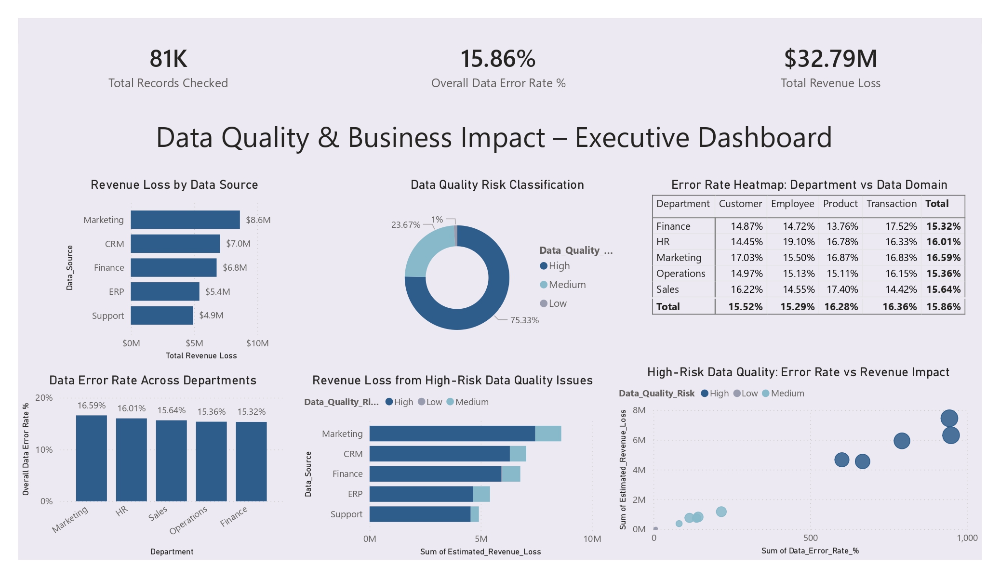

# Data Quality & Business Impact – Executive Dashboard

## Project Overview

This Power BI dashboard analyzes data quality issues and their financial impact on business operations. It helps organizations identify high-risk data sources, monitor error rates across departments, and quantify revenue losses caused by poor data quality.

The dashboard enables data governance teams, business leaders, and analysts to make informed decisions for improving data accuracy and reducing operational risk.

---

## Dashboard Preview

---

## Key Metrics

| KPI | Value |
|------|--------|
| Total Records Checked | 81K |
| Overall Data Error Rate | 15.86% |
| Total Revenue Loss | $32.79M |

---

## Dashboard Features

### 1. Revenue Loss by Data Source
Analyzes revenue impact caused by data quality issues across:

- Marketing
- CRM
- Finance
- ERP
- Support

Identifies the most costly sources of poor-quality data.

---

### 2. Data Quality Risk Classification
Categorizes records into:

- High Risk
- Medium Risk
- Low Risk

Helps prioritize remediation efforts.

---

### 3. Error Rate Heatmap
Compares error rates across:

**Departments**
- Finance
- HR
- Marketing
- Operations
- Sales

**Data Domains**
- Customer
- Employee
- Product
- Transaction

Provides a detailed view of data quality performance.

---

### 4. Department Error Rate Analysis
Measures overall error percentages by department and highlights areas requiring corrective action.

---

### 5. Revenue Loss from High-Risk Data Issues
Shows the financial impact of high, medium, and low-risk data quality problems.

Supports business case development for data governance initiatives.

---

### 6. Error Rate vs Revenue Impact Analysis
Visualizes the relationship between:

- Data Error Rate
- Estimated Revenue Loss

Helps identify high-impact risk areas.

---

## Business Objectives

- Improve data quality and governance
- Reduce operational risk
- Minimize revenue loss
- Identify high-risk data sources
- Support compliance and reporting accuracy
- Strengthen decision-making with reliable data

---

## Key Insights

### Financial Impact
- Poor data quality contributes to approximately **$32.79M** in revenue loss.
- Marketing and CRM data sources account for the highest financial impact.

### Risk Analysis
- More than 75% of identified issues fall into the high-risk category.
- High-risk records contribute the majority of business losses.

### Department Performance
- Marketing and HR exhibit the highest data error rates.
- Finance maintains relatively lower error rates compared to other departments.

### Strategic Recommendations
- Implement automated data validation controls.
- Strengthen master data management processes.
- Prioritize remediation of high-risk data sources.
- Establish continuous data quality monitoring.

---

## Tools & Technologies

- Power BI
- DAX
- Power Query
- Excel / CSV Dataset
- Data Modeling
- Data Governance Analytics

---

## Skills Demonstrated

- Data Quality Analytics
- Data Governance Reporting
- Risk Analysis
- Financial Impact Assessment
- Executive Dashboard Design
- KPI Development
- DAX Measures
- Data Modeling
- Power Query

---

## Business Value

This dashboard helps organizations:

- Quantify the cost of poor data quality
- Improve data governance initiatives
- Reduce revenue leakage
- Monitor enterprise data health
- Prioritize corrective actions
- Support executive-level decision-making

---

## Author

Yashwanth Katuru

Aspiring Data Analyst | Power BI Developer | Business Intelligence & Data Governance Enthusiast
